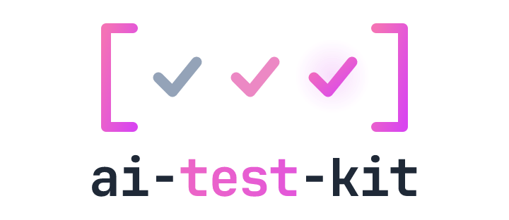

<div align="center">

<picture>
  <source media="(prefers-color-scheme: dark)" srcset="assets/logo-dark.png" />
  
</picture>

<p align="center">Test kit for AI SDK apps: mock models, content builders and stream helpers, fully type-safe</p>
<p align="center">
  <a href="https://www.npmjs.com/package/ai-test-kit" alt="ai-test-kit"></a> <a href="https://github.com/zirkelc/ai-test-kit/actions/workflows/ci.yml" alt="CI"></a>
</p>

</div>

This library provides a simple, type-safe API for testing AI SDK-powered apps. It gives you small, composable builders for mocking models, generating content and stream parts, and asserting on the results, so your tests stay short, deterministic, and fully typed.

### Why?

The AI SDK ships `MockLanguageModelV4` and a few other test primitives, but they are deliberately low-level. In practice every project ends up rebuilding the same helpers to:

- **Mock a model**: return text, throw an error, or replay a scripted response per call
- **Generate content and stream parts**: assemble valid `text-start` → `text-delta` → `text-end` → `finish` streams by hand
- **Simulate and consume streams**: simulate streams with delays and drain them to assert on the chunks

This library turns that boilerplate into one-liners, ready to use. Models are vitest-compatible spy functions, so you can assert on calls with the full Vitest API while also reading the recorded call arguments directly (and the call record works under any test runner, or none).

### Installation

> [!NOTE]
> Version compatibility:
>
> - Use [`ai-test-kit@2.x`](https://github.com/zirkelc/ai-test-kit/tree/v2.x) for AI SDK v6 (provider spec `v3`)
> - Use [`ai-test-kit@3.x`](https://github.com/zirkelc/ai-test-kit/tree/next) for AI SDK v7 (provider spec `v4`)

```bash
npm install -D ai-test-kit@2 # for AI SDK v6
npm install -D ai-test-kit@3 # for AI SDK v7
```

`ai` is a peer dependency. The spy engine ships with the kit via [`@vitest/spy`](https://www.npmjs.com/package/@vitest/spy), so Vitest itself is not required — the recorded call data works under any test runner, or none.

## Usage

The API is split by layer, each under its own entry point so an import only pulls in the types it needs:

- `ai-test-kit` — generic, layer-agnostic helpers: build, drain, and convert `ReadableStream`s and `AsyncIterable`s with `Streams` and `Iterables`
- `ai-test-kit/language` — the model layer: mock a `LanguageModelV4` and build the values it returns with the `Language` namespace, both content for [`generateText()`](https://ai-sdk.dev/docs/reference/ai-sdk-core/generate-text) and `stream`-prefixed parts for [`streamText()`](https://ai-sdk.dev/docs/reference/ai-sdk-core/stream-text)
- `ai-test-kit/embedding` — the embedding layer: mock an `EmbeddingModelV4` and build vectors and results with the `Embedding` namespace
- `ai-test-kit/image` — the image layer: mock an `ImageModelV4` and build sample images and results with the `Image` namespace
- `ai-test-kit/ui` — the UI layer: build `UIMessagePart`, `UIMessageChunk`, and `UIMessage` fixtures, optionally typed to your own `UIMessage`

### Streams and Iterables

Layer-agnostic helpers from the root entry `ai-test-kit` to build, drain, and convert `ReadableStream`s and `AsyncIterable`s. They work with any part type, so they pair with every layer below (language stream parts, UI chunks, plain values).

```typescript
import { Streams } from 'ai-test-kit';
import { Language } from 'ai-test-kit/language';

const parts = [...Language.streamText('Hello World'), Language.streamFinish()];

const drained = await Streams.toArray(Streams.from(parts)); // round-trips parts
```

### Errors

Layer-agnostic error builders from the root entry `ai-test-kit` for the provider errors a model throws. Drop one straight into a mock to drive retry, fallback, and error-handling tests. The named factories carry the realistic shape of each category (status code, message, `Retry-After`); `Errors.from` is the escape hatch for anything else.

```typescript
import { generateText } from 'ai';
import { Errors } from 'ai-test-kit';
import { MockLanguageModel } from 'ai-test-kit/language';

const model = MockLanguageModel.from([Errors.rateLimited({ retryAfter: 5 }), 'Recovered']);

await generateText({ model, prompt: 'Hello' }).catch(() => {}); // first call throws a 429
const { text } = await generateText({ model, prompt: 'Hello' }); // second call recovers
text; // 'Recovered'
```

`isRetryable` is left to `APICallError`, which derives it from the status code (`408`/`409`/`429`/`5xx`), matching how the AI SDK builds the error. `retryAfter` accepts seconds (`number`), an absolute `Date`, or `{ ms }`, mapping to the `retry-after` / `retry-after-ms` headers a provider sends.

### Language Models

Helpers from `ai-test-kit/language` to mock a model and build the content and stream parts it returns.

> [!NOTE]
> This kit mocks at the `LanguageModelV4` interface — the boundary between the AI SDK and a provider. It does not mock the HTTP/wire layer, so provider-specific wire behavior (e.g. an error inside a 200-OK SSE body) is out of scope. For that, drive a real provider against a fake server with [`@ai-sdk/test-server`](https://www.npmjs.com/package/@ai-sdk/test-server).

#### Creating a Mock Model

Pass a response to `MockLanguageModel.from()`. A `string` is the common case: it serves both `doGenerate` and `doStream`.

```typescript
import { generateText } from 'ai';
import { MockLanguageModel } from 'ai-test-kit/language';

const model = MockLanguageModel.from('Hello, world!');

const result = await generateText({ model, prompt: 'Hi' });
result.text; // 'Hello, world!'
```

#### Generate and Stream

The same model answers both `generateText()` and `streamText()`. For streaming, a string is assembled into a `stream-start` → `text-start` → `text-delta*` → `text-end` → `finish` sequence.

```typescript
import { streamText } from 'ai';
import { Streams } from 'ai-test-kit';
import { MockLanguageModel } from 'ai-test-kit/language';

const model = MockLanguageModel.from('Hello World');

const result = streamText({ model, prompt: 'Hi' });
const text = (await Streams.toArray(result.textStream)).join(''); // 'Hello World'
```

#### Throwing Errors

Pass an `Error` to make the model throw, for testing error handling and retries.

```typescript
const model = MockLanguageModel.from(new Error('rate limited'));

await expect(generateText({ model, prompt: 'Hi' })).rejects.toThrow();
```

#### Sequenced Responses

Pass an array to script a response per call. The model advances through the array and clamps to the last entry once exhausted, ideal for retry and fallback tests. An array models the sequence directly and is easy to build programmatically.

```typescript
// fail, fail, then succeed
const model = MockLanguageModel.from([new Error('429'), new Error('429'), 'recovered']);

await generateText({ model, prompt: 'Hi' }).catch(() => {});
await generateText({ model, prompt: 'Hi' }).catch(() => {});
const result = await generateText({ model, prompt: 'Hi' });
result.text; // 'recovered'
```

#### Building Content

Use the `Language` namespace to assemble the parts a model returns from `doGenerate`. Pass them via the `content` response form. Like a plain `string`, a `{ content }` mock also serves `streamText()` — the stream is derived from the parts.

```typescript
import { Language, MockLanguageModel } from 'ai-test-kit/language';

const model = MockLanguageModel.from({
  content: [
    Language.text('Here is the weather:'),
    Language.toolCall({ toolCallId: 'call-1', toolName: 'weather', input: { city: 'Tokyo' } }),
  ],
});

const result = await generateText({ model, prompt: 'Weather in Tokyo?' });
result.toolCalls[0].toolName; // 'weather'
```

The tool builders (`toolCall`, `toolResult`, `streamToolInput`) accept an optional tool-set generic. Pass your tool-set (e.g. `<typeof tools>`) and `toolName` is constrained to its keys, with `input` / `result` typed to the matching tool's input / output. Omit it and the builders stay loose (any name, `unknown` input), so existing call sites are unaffected.

```typescript
import { Language } from 'ai-test-kit/language';

const tools = {
  weather: tool({ inputSchema: z.object({ city: z.string() }), outputSchema: z.object({ tempC: z.number() }) }),
};

Language.toolCall<typeof tools>({ toolCallId: 'c1', toolName: 'weather', input: { city: 'Tokyo' } });
Language.toolCall<typeof tools>({ toolCallId: 'c1', toolName: 'weahter', input: { city: 'Tokyo' } }); // ✗ unknown tool name
Language.toolCall<typeof tools>({ toolCallId: 'c1', toolName: 'weather', input: { region: 'Tokyo' } }); // ✗ wrong input shape
```

#### Usage and Finish Reason

By default a mock reports a `stop` finish reason and a small fixed token usage. When you don't set a finish reason, it is derived from the content: a pending client tool call yields `tool-calls`, matching how a real provider reports it (a provider-executed call, or one whose result is already in the content, keeps `stop`). Override it via the `{ content, finishReason, usage }` form to test code that branches on the finish reason or tracks token usage. `finishReason` accepts a bare unified string (`'length'`) or a full object; an explicit value always wins over derivation; `Language.usage(...)` builds the token usage.

```typescript
import { Language, MockLanguageModel } from 'ai-test-kit/language';

const model = MockLanguageModel.from({
  content: [Language.text('truncated…')],
  finishReason: 'length',
  usage: Language.usage({ outputTokens: { total: 50 } }),
});

const result = await generateText({ model, prompt: 'Hi' });
result.finishReason; // 'length'
result.usage; // the configured token usage
```

#### Building Streams

Use the `stream`-prefixed `Language` builders to compose a stream from atoms. The text-like builders return a `start` / `delta` / `end` block (no trailing `finish`), so streams compose by concatenation.

```typescript
import { Language, MockLanguageModel } from 'ai-test-kit/language';

const model = MockLanguageModel.from({
  doStream: [
    Language.streamStart(),
    ...Language.streamText('Hello', { length: 1 }), // emit one character per delta
    ...Language.streamToolInput({ id: 't1', toolName: 'weather', input: { city: 'Tokyo' } }),
    Language.toolCall({ toolCallId: 'call-1', toolName: 'weather', input: { city: 'Tokyo' } }),
    Language.streamFinish(),
  ],
});
```

For the common `stream-start` → content → `finish` shape, `Language.streamParts(...)` builds the whole array in one call (the streaming sibling of `Language.result`), so you rarely assemble it by hand:

```typescript
import { Language, MockLanguageModel } from 'ai-test-kit/language';

const model = MockLanguageModel.from({ doStream: Language.streamParts('Hello World') });
// for an error stream, compose explicitly:
const failing = MockLanguageModel.from({ doStream: [Language.streamStart(), Language.streamError(new Error('boom'))] });
```

`streamParts` returns the raw parts array — splice it, snapshot it, or feed it to `doStream` as above. When you need a consumable `{ stream }` instead — passing a ready stream, or returning from the function form of `doStream` — use `Language.streamResult(...)`, which wraps the same `string` or parts:

```typescript
const model = MockLanguageModel.from({
  doStream: ({ prompt }) => Language.streamResult(prompt.length > 0 ? 'has prompt' : 'empty'),
});
```

For timing tests, give the `doStream` form a `{ chunks, ... }` object with delays (or use `Streams.simulate`):

```typescript
const model = MockLanguageModel.from({
  doStream: {
    chunks: [...Language.streamText('slow'), Language.streamFinish()],
    initialDelayInMs: 10,
    chunkDelayInMs: 5,
  },
});
```

#### Aborting a Stream

The call's `abortSignal` is wired into the simulated stream automatically, so a stream aborted mid-flight errors with an `AbortError` just like a real provider — no custom `ReadableStream` needed. Pair it with `chunkDelayInMs` so the abort can land between chunks.

```typescript
import { Language, MockLanguageModel } from 'ai-test-kit/language';

const controller = new AbortController();

const model = MockLanguageModel.from({
  doStream: { chunks: [...Language.streamText('Hello World'), Language.streamFinish()], chunkDelayInMs: 10 },
});

const result = streamText({ model, prompt: 'Hi', abortSignal: controller.signal });
// ...later, controller.abort() makes the stream reject with an AbortError
```

#### Different Responses per Method

Use the `{ doGenerate, doStream }` form to drive `doGenerate` and `doStream` independently — for example to return plain text non-streaming but a richer sequence when streamed. The keys mirror the `LanguageModelV4` method names.

```typescript
import { Language, MockLanguageModel } from 'ai-test-kit/language';

const model = MockLanguageModel.from({
  doGenerate: 'Final answer',
  doStream: [...Language.streamText('Final answer'), Language.streamFinish()],
});
```

#### Input-Dependent Responses

For a response that depends on the call (the prompt, tools, or settings), pass a function to `doGenerate` / `doStream`. It receives the call options and returns the result directly — the escape hatch for cases the declarative forms can't express, including a fully custom `LanguageModelV4StreamResult`. The `Language.result` / `Language.streamResult` builders pair well here.

```typescript
import { Language, MockLanguageModel } from 'ai-test-kit/language';

const model = MockLanguageModel.from({
  doGenerate: async ({ prompt }) => Language.result(prompt.length > 1 ? 'multi-turn' : 'single-turn'),
});
```

#### Deterministic Output

`generateText()` / `streamText()` assign a random `response.id` and a wall-clock `response.timestamp`. When a test asserts on those (e.g. snapshots), spread `Options` to pin them. It is not needed for ordinary assertions like `result.text`.

```typescript
import { MockLanguageModel, Options } from 'ai-test-kit/language';

const model = MockLanguageModel.from('Hi');

await generateText({ model, prompt: 'x', ...Options.generate });
streamText({ model, prompt: 'x', ...Options.stream });
```

#### Inspecting Calls

`doGenerate` and `doStream` are vitest-compatible spy functions (powered by [`@vitest/spy`](https://www.npmjs.com/package/@vitest/spy)), so the full Vitest spy API and matchers work. Every call is recorded on `doGenerate.mock.calls` / `doStream.mock.calls`, which you can read without the Vitest runner (so the kit works under any test runner, or none).

```typescript
const model = MockLanguageModel.from('hi');

await generateText({ model, prompt: 'question' });

// Vitest matchers
expect(model.doGenerate).toHaveBeenCalledTimes(1);

// Recorded call options (each entry is the call's argument tuple)
model.doGenerate.mock.calls.length; // 1
model.doGenerate.mock.calls[0][0].prompt;
```

#### Custom Identity

Override `provider` and `modelId`; otherwise the model uses `mock-provider` and an auto-incrementing id.

```typescript
const model = MockLanguageModel.from('hi', { provider: 'acme', modelId: 'acme-1' });
model.provider; // 'acme'
model.modelId; // 'acme-1'
```

### Embedding Models

Helpers from `ai-test-kit/embedding` to mock an `EmbeddingModelV4`. `MockEmbeddingModel.from()` takes the embedding vectors directly; pass an `Error` to throw, a function for input-dependent output, or a top-level array to script responses per call. `Embedding.vector(dimension?)` builds a sample vector when you don't care about the exact numbers.

#### Mocking Embeddings

```typescript
import { embed } from 'ai';
import { Embedding, MockEmbeddingModel } from 'ai-test-kit/embedding';

const model = MockEmbeddingModel.from([Embedding.vector()]);

const { embedding } = await embed({ model, value: 'Hello' });
embedding; // [0.1, 0.2, 0.3]
```

#### Retry and Sequenced Responses

A top-level array scripts a response per call (advancing, then clamping to the last), so you can model a failure that recovers. An embeddings matrix (`number[][]`) is one level shallower than a sequence, so the two never collide.

```typescript
const model = MockEmbeddingModel.from([new Error('429'), [[0.1, 0.2, 0.3]]]);

await embed({ model, value: 'Hello' }).catch(() => {}); // first call throws
const { embedding } = await embed({ model, value: 'Hello' }); // second call recovers
```

### Image Models

Helpers from `ai-test-kit/image` to mock an `ImageModelV4`. `MockImageModel.from()` takes the generated images (base64 strings or binary data); `Image.png()` is a ready-made base64 1x1 PNG (also exported as `base64Png1x1`).

#### Mocking Image Generation

```typescript
import { generateImage } from 'ai';
import { Image, MockImageModel } from 'ai-test-kit/image';

const model = MockImageModel.from([Image.png()]);

const { image } = await generateImage({ model, prompt: 'A sunset' });
image.base64; // the configured base64 PNG
```

#### Retry and Sequenced Responses

```typescript
const model = MockImageModel.from([new Error('429'), [Image.png()]]);

await generateImage({ model, prompt: 'A sunset' }).catch(() => {}); // first call throws
await generateImage({ model, prompt: 'A sunset' }); // second call recovers
```

### UI Messages

Helpers from `ai-test-kit/ui` to build the messages, parts, and chunks exchanged between the server and the client. Use them to test code that operates on `UIMessage`, `UIMessageChunk`, or `UIMessagePart` (custom transports, stream consumers, message reducers). The builders return plain objects shaped to the AI SDK's UI types, so the entry has no runtime cost beyond the types.

#### Building Parts, Chunks, and Messages

`UIParts` builds message parts, `UIChunks` builds stream chunks, and `UIMessages` builds whole messages from a `string` shortcut or an array of parts.

```typescript
import { UIChunks, UIMessages, UIParts } from 'ai-test-kit/ui';

const message = UIMessages.assistant([
  UIParts.text('Here is the weather:'),
  UIParts.sourceUrl({ sourceId: 's1', url: 'https://example.com' }),
]);

const chunks = [
  UIChunks.start(),
  ...UIChunks.text('Hello', { length: 1 }), // text-start → text-delta* → text-end
  UIChunks.finish(),
];
```

The text-like builders (`UIChunks.text` / `UIChunks.reasoning` / `UIChunks.toolInput`) return a block of atoms, so streams compose by concatenation. The individual atoms (`UIChunks.textStart`, `textDelta`, …) are also available.

#### Consuming a Chunk Stream

The chunk builders shine when testing code that consumes a `UIMessageChunk` stream. `Streams` (from the root `ai-test-kit`) is layer-agnostic, so it builds and drains chunk streams too.

```typescript
import { Streams } from 'ai-test-kit';
import { UIChunks } from 'ai-test-kit/ui';

const chunks = [UIChunks.start(), ...UIChunks.text('Hello'), UIChunks.finish()];

const stream = Streams.from(chunks); // ReadableStream<UIMessageChunk>

// pass `stream` to the code under test (a transport, reducer, readUIMessageStream, …),
// or drain it to assert on the chunks directly
const received = await Streams.toArray(stream);
received.length; // 5
```

#### Typing to Your Own `UIMessage`

By default `data` payloads, tool names, and message metadata are loose. Pass your own `UIMessage` type to `fromUIMessage()` once and the bound builders infer them.

```typescript
import type { UIMessage } from 'ai';
import { fromUIMessage } from 'ai-test-kit/ui';

type MyUIMessage = UIMessage<
  { traceId: string }, // metadata
  { weather: { city: string } }, // data parts
  { search: { input: { q: string }; output: { hits: number } } } // tools
>;

const { UIParts, UIChunks, UIMessages } = fromUIMessage<MyUIMessage>();

UIChunks.data('weather', { city: 'Tokyo' }); // name + payload typed
UIChunks.messageMetadata({ traceId: 't1' }); // metadata typed
UIParts.tool('search', { toolCallId: 'c1', state: 'output-available', input: { q: 'cats' }, output: { hits: 3 } });
```

## API

### Streams and Iterables

Generic, layer-agnostic helpers exported from the root `ai-test-kit`.

#### `Streams`

Operations for building, draining, and converting `ReadableStream`s.

#### `.from(parts)`

```ts
Streams.from<CHUNK>(chunks: CHUNK[]): ReadableStream<CHUNK>
// Streams.from([a, b]): ReadableStream emitting a, then b
```

#### `.simulate(chunks, options?)`

```ts
Streams.simulate<CHUNK>(chunks: CHUNK[], options?: StreamDelayOptions): ReadableStream<CHUNK>
// Streams.simulate([a, b], { chunkDelayInMs: 5 }): ReadableStream emitting a, then b, with delays
```

#### `.toArray(stream)`

```ts
Streams.toArray<CHUNK>(stream: ReadableStream<CHUNK>): Promise<CHUNK[]>
// Streams.toArray(stream): Promise<[a, b]>
```

#### `.toIterable(stream)`

```ts
Streams.toIterable<CHUNK>(stream: ReadableStream<CHUNK>): ReadableStream<CHUNK> & AsyncIterable<CHUNK>
// for await (const chunk of Streams.toIterable(stream)) { ... } — consume a stream via for-await
```

#### `Iterables`

The async-iterable complement to `Streams`: build, drain, and convert `AsyncIterable`s (async generators, and anything consumed via `for await`). Use it when the code under test produces or consumes a plain async iterable rather than a `ReadableStream`. Cross back to the `Streams` toolbox with `.toStream`.

#### `.from(items)`

```ts
Iterables.from<ITEM>(items: ITEM[]): AsyncIterable<ITEM>
// Iterables.from([a, b]): an async iterable yielding a, then b
```

#### `.toArray(iterable)`

```ts
Iterables.toArray<ITEM>(iterable: AsyncIterable<ITEM>): Promise<ITEM[]>
// Iterables.toArray(iterable): Promise<[a, b]>
```

#### `.toStream(iterable)`

```ts
Iterables.toStream<ITEM>(iterable: AsyncIterable<ITEM>): ReadableStream<ITEM>
// Iterables.toStream(iterable): a ReadableStream emitting a, then b
```

### Errors

Generic, layer-agnostic error builders exported from the root `ai-test-kit`.

#### `Errors`

Builders for the provider errors a mock model throws. The named factories set a realistic status code and message; `isRetryable` is left to `APICallError`, which derives it from the status (`408`/`409`/`429`/`5xx`).

#### `.from(options?)`

The generic `APICallError` builder; fills the fields a test rarely cares about (`url`, `requestBodyValues`).

```ts
Errors.from(options?: ApiCallErrorOptions): APICallError
// Errors.from({ statusCode: 500 }): a retryable APICallError (status-derived)
```

#### `.rateLimited(options?)`

```ts
Errors.rateLimited(options?: { message?: string; retryAfter?: RetryAfter }): APICallError
// status 429; retryAfter sets a retry-after / retry-after-ms header
```

#### `.serviceUnavailable(options?)`

```ts
Errors.serviceUnavailable(options?: { message?: string; retryAfter?: RetryAfter }): APICallError
// status 503; retryAfter sets a retry-after / retry-after-ms header
```

#### `.serviceOverloaded(options?)`

```ts
Errors.serviceOverloaded(options?: { message?: string }): APICallError
// status 529
```

#### `.internalServerError(options?)`

```ts
Errors.internalServerError(options?: { message?: string }): APICallError
// status 500
```

#### `.badRequest(options?)`

```ts
Errors.badRequest(options?: { message?: string }): APICallError
// status 400 (not retryable)
```

#### `.unauthorized(options?)`

```ts
Errors.unauthorized(options?: { message?: string }): APICallError
// status 401 (not retryable)
```

#### `.timeout(options?)`

```ts
Errors.timeout(options?: { message?: string }): DOMException
// a TimeoutError DOMException, as AbortSignal.timeout() produces
```

#### `.abort(options?)`

```ts
Errors.abort(options?: { message?: string }): DOMException
// an AbortError DOMException, as controller.abort() produces
```

### Language Models

Builders and the mock model from `ai-test-kit/language`.

#### `MockLanguageModel`

Factory for the mock model. The model returned by `.from()` exposes `doGenerate` / `doStream` as vitest-compatible spy functions and records call options on `doGenerate.mock.calls` / `doStream.mock.calls`. Build the values a model returns with [`Language`](#language). The namespace and the instance type share the name.

#### `.from(input?, options?)`

Creates a mock `LanguageModelV4` from a response spec (or a sequence of them).

```ts
MockLanguageModel.from(input?: MockResponse | MockResponse[], options?: MockLanguageModelOptions): MockLanguageModel
// MockLanguageModel.from('Hi'): a model returning 'Hi' from generate and stream
// MockLanguageModel.from(new Error('429')): a model that throws from generate and stream
// MockLanguageModel.from({ content: [Language.text('Hi')] }): a model returning those parts (stream derived from them)
// MockLanguageModel.from({ doGenerate: 'A', doStream: [...] }): drives doGenerate and doStream independently
// MockLanguageModel.from({ doGenerate: (options) => result }): a function of the call options (input-dependent)
// MockLanguageModel.from([new Error('429'), 'ok']): sequences responses per call, clamping to the last
```

- `input` defaults to a single response repeated for every call; an array sequences one response per call, clamped to the last. See [`MockResponse`](#mockresponse).
- `options.provider` defaults to `mock-provider`; `options.modelId` defaults to an auto-incrementing `mock-model-{n}`.

#### `.callOptions(overrides?)`

```ts
MockLanguageModel.callOptions(overrides?: Partial<LanguageModelV4CallOptions>): LanguageModelV4CallOptions
// MockLanguageModel.callOptions(): a valid options object with a default 'Hello!' user prompt
// MockLanguageModel.callOptions({ temperature: 0.5 }): the default plus the override — for calling model.doGenerate / doStream directly without casts
```

#### `Language`

Builders for everything a language model returns. The static content parts (`text`, `toolCall`, …) go in the `content` form of [`MockResponse`](#mockresponse); the `stream`-prefixed parts (`streamText`, `streamFinish`, …) compose a `doStream` sequence; `result` / `streamResult` / `usage` wrap them into full results. The text-like stream builders return a `start` / `delta` / `end` block (without `finish`), so streams compose by concatenation. The `stream` prefix mirrors the SDK's `generateText` / `streamText` split.

##### Content parts

#### `.text(text)`

```ts
Language.text(text: string): LanguageModelV4Text
// Language.text('Hi'): { type: 'text', text: 'Hi' }
```

#### `.reasoning(text)`

```ts
Language.reasoning(text: string): LanguageModelV4Reasoning
// Language.reasoning('Because...'): { type: 'reasoning', text: 'Because...' }
```

#### `.toolCall(args)`

```ts
Language.toolCall<TOOLS extends ToolSet = never>(args: { toolCallId: string; toolName: string; input: unknown }): LanguageModelV4ToolCall
// Language.toolCall({ toolCallId: 'c1', toolName: 'weather', input: { city: 'Tokyo' } }): { type: 'tool-call', toolCallId: 'c1', toolName: 'weather', input: '{"city":"Tokyo"}' } — input is JSON-stringified unless already a string. Valid in content and streams.
// Pass <typeof tools> to constrain toolName to a tool key and input to that tool's input type; omit it to stay loose.
```

#### `.toolResult(args)`

```ts
Language.toolResult<TOOLS extends ToolSet = never>(args: { toolCallId: string; toolName: string; result: unknown; isError?: boolean }): LanguageModelV4ToolResult
// Language.toolResult({ toolCallId: 'c1', toolName: 'weather', result: { temp: 20 } }): { type: 'tool-result', toolCallId: 'c1', toolName: 'weather', result: { temp: 20 } }
// Pass <typeof tools> to constrain toolName to a tool key and result to that tool's output type; omit it to stay loose.
```

#### `.toolApprovalRequest(args)`

A request for the user to approve a tool call before it runs.

```ts
Language.toolApprovalRequest(args: { approvalId: string; toolCallId: string; providerMetadata?: SharedV4ProviderMetadata }): LanguageModelV4ToolApprovalRequest
// Language.toolApprovalRequest({ approvalId: 'a1', toolCallId: 'c1' }): { type: 'tool-approval-request', approvalId: 'a1', toolCallId: 'c1' }
```

#### `.file(args)`

```ts
Language.file(args: { mediaType: string; data: string | Uint8Array }): LanguageModelV4File
// Language.file({ mediaType: 'image/png', data: 'abc' }): { type: 'file', mediaType: 'image/png', data: { type: 'data', data: 'abc' } }
```

#### `.source(args)`

```ts
Language.source(args: { id: string; url: string; title?: string }): LanguageModelV4Source
// Language.source({ id: 's1', url: 'https://example.com' }): { type: 'source', sourceType: 'url', id: 's1', url: 'https://example.com' }
```

#### `.reasoningFile(args)`

A file generated during reasoning. New in AI SDK 7.

```ts
Language.reasoningFile(args: { mediaType: string; data: string | Uint8Array }): LanguageModelV4ReasoningFile
// Language.reasoningFile({ mediaType: 'image/png', data: 'abc' }): { type: 'reasoning-file', mediaType: 'image/png', data: { type: 'data', data: 'abc' } }
```

#### `.custom(args)`

Provider-specific custom content; `kind` is `{provider}.{type}`. New in AI SDK 7.

```ts
Language.custom(args: { kind: `${string}.${string}`; providerMetadata?: SharedV4ProviderMetadata }): LanguageModelV4CustomContent
// Language.custom({ kind: 'acme.thinking' }): { type: 'custom', kind: 'acme.thinking' }
```

##### Stream parts

#### `.streamText(text, options?)`

```ts
Language.streamText(text: string | string[], options?: StreamPartOptions): LanguageModelV4StreamPart[]
// Language.streamText('Hi'): [{ type: 'text-start', id: '1' }, { type: 'text-delta', id: '1', delta: 'Hi' }, { type: 'text-end', id: '1' }]
// Language.streamText(['He', 'llo']): an explicit two-delta split (string[] used as the deltas verbatim; length/separator ignored)
```

#### `.streamReasoning(text, options?)`

```ts
Language.streamReasoning(text: string | string[], options?: StreamPartOptions): LanguageModelV4StreamPart[]
// Language.streamReasoning('Hmm'): [{ type: 'reasoning-start', id: '1' }, { type: 'reasoning-delta', id: '1', delta: 'Hmm' }, { type: 'reasoning-end', id: '1' }]
```

#### `.streamToolInput(args)`

```ts
Language.streamToolInput<TOOLS extends ToolSet = never>(args: { id: string; toolName: string; input: unknown; length?: number }): LanguageModelV4StreamPart[]
// Language.streamToolInput({ id: 't1', toolName: 'weather', input: { city: 'Tokyo' } }): [{ type: 'tool-input-start', id: 't1', toolName: 'weather' }, { type: 'tool-input-delta', id: 't1', delta: '{"city":"Tokyo"}' }, { type: 'tool-input-end', id: 't1' }]
// Pass <typeof tools> to constrain toolName to a tool key and input to that tool's input type; omit it to stay loose.
```

#### `.streamStart(warnings?)`

```ts
Language.streamStart(warnings?: SharedV4Warning[]): LanguageModelV4StreamPart
// Language.streamStart(): { type: 'stream-start', warnings: [] }
```

#### `.streamFinish(options?)`

```ts
Language.streamFinish(options?: { finishReason?: LanguageModelV4FinishReason | LanguageModelV4FinishReason['unified']; usage?: LanguageModelV4Usage; providerMetadata?: SharedV4ProviderMetadata }): LanguageModelV4StreamPart
// Language.streamFinish(): { type: 'finish', finishReason: { unified: 'stop', raw: 'stop' }, usage }
// Language.streamFinish({ providerMetadata: { openai: { responseId: 'r1' } } }): extra fields pass through onto the part
```

#### `.streamError(error)`

```ts
Language.streamError(error: unknown): LanguageModelV4StreamPart
// Language.streamError(new Error('boom')): { type: 'error', error: Error('boom') }
```

#### `.streamResponseMetadata(meta?)`

```ts
Language.streamResponseMetadata(meta?: LanguageModelV4ResponseMetadata): LanguageModelV4StreamPart
// Language.streamResponseMetadata({ id: 'r1' }): { type: 'response-metadata', id: 'r1' }
```

#### `.streamRaw(rawValue)`

```ts
Language.streamRaw(rawValue: unknown): LanguageModelV4StreamPart
// Language.streamRaw({ foo: 1 }): { type: 'raw', rawValue: { foo: 1 } }
```

##### Results and usage

#### `.usage(overrides?)` / `.usage(inputTotal, outputTotal)`

```ts
Language.usage(overrides?: { inputTokens?: Partial<LanguageModelV4Usage['inputTokens']>; outputTokens?: Partial<LanguageModelV4Usage['outputTokens']> }): LanguageModelV4Usage
Language.usage(inputTotal: number, outputTotal: number): LanguageModelV4Usage
// Language.usage({ outputTokens: { total: 99 } }): { inputTokens: { total: 10, … }, outputTokens: { total: 99, … } }
// Language.usage(5, 8): each total mirrors into its primary sub-field — { inputTokens: { total: 5, noCache: 5, … }, outputTokens: { total: 8, text: 8, … } }
```

#### `.result(input, options?)`

```ts
Language.result(input: string | LanguageModelV4Content[], options?: ResultOptions): LanguageModelV4GenerateResult
// Language.result('hi'): { content: [{ type: 'text', text: 'hi' }], finishReason: { unified: 'stop', raw: 'stop' }, usage, warnings: [] }
// Language.result([Language.text('hi')], { finishReason: 'length', usage: Language.usage(5, 8) }): finishReason coerced from a unified string; extra fields pass through
// When finishReason is omitted it is derived from content: a pending client tool call yields 'tool-calls', otherwise 'stop'.
```

#### `.streamParts(input, options?)`

The array-returning sibling of `result`: the full `stream-start` → content → `finish` parts for a response, as a plain array you can splice, snapshot, feed to a `doStream` mock, or wrap with `streamResult`. A `string` becomes one text part. `options` are the `streamFinish` options (`finishReason`, `usage`, passthrough), applied to the trailing `finish` part. Like `result`, an omitted `finishReason` is derived from content (a pending client tool call yields `tool-calls`); note the standalone `streamFinish` atom is content-blind and always defaults to `stop`. For an error stream, compose it explicitly: `[Language.streamStart(), Language.streamError(e)]`.

```ts
Language.streamParts(input: string | LanguageModelV4Content[], options?): LanguageModelV4StreamPart[]
// Language.streamParts('Hello'): [stream-start, text-start, text-delta…, text-end, finish]
// Language.streamParts([Language.text('a'), Language.toolCall({…})], { finishReason: 'tool-calls', usage }): start → content → finish
```

#### `.streamResult(input, options?)`

```ts
Language.streamResult(input: string | LanguageModelV4StreamPart[] | ReadableStream<LanguageModelV4StreamPart>, options?: StreamDelayOptions): LanguageModelV4StreamResult
// Language.streamResult('hi'): { stream } — a ReadableStream of stream-start → text → finish
// Language.streamResult([...Language.streamText('hi'), Language.streamFinish()]): { stream } — a ReadableStream of the given parts
// Language.streamResult(Streams.from(parts)): { stream } — wraps an existing ReadableStream as-is (delays ignored)
```

#### `Options`

Determinism helpers to spread into `generateText()` / `streamText()`.

#### `.generateId()`

```ts
Options.generateId(): string
// Options.generateId(): 'aitxt-mock-id'
```

#### `.generate`

```ts
Options.generate: { _internal: { generateId } }
// generateText({ model, prompt: 'x', ...Options.generate }): a deterministic generateId
```

#### `.stream`

```ts
Options.stream: { _internal: { generateId, now } }
// streamText({ model, prompt: 'x', ...Options.stream }): a deterministic generateId and now
```

> [!NOTE]
> `Options.stream` pins timestamps via `_internal.now`, but the AI SDK uses `new Date()` directly on the `finish-step` part in the error streaming path. Tests that hit that path additionally need `vi.useFakeTimers()`.

### Embedding Models

Builders from `ai-test-kit/embedding`. `MockEmbeddingModel` is the mock factory; `Embedding` builds the values it returns. Each is exported as both a value and a type.

#### `MockEmbeddingModel`

The mock factory, and the type of a model created by `.from()`.

#### `.from(input?, options?)`

Creates a mock `EmbeddingModelV4` whose `doEmbed` is a vitest-compatible spy function. `input` is an `Array<EmbeddingVector>` (the embeddings), an `Error`, a full result, a function of the call options, or an `Array` of those to sequence responses per call. `options` is `{ provider?, modelId?, maxEmbeddingsPerCall?, supportsParallelCalls? }`. Each call is recorded on `doEmbed.mock.calls`.

#### `.callOptions(overrides?)`

Builds a minimal valid `EmbeddingModelV4CallOptions` (default `values: ['hello']`, plus any overrides), for invoking `doEmbed` directly without casts.

#### `Embedding`

Builders for the values an embedding model returns.

#### `.vector(dimension?)`

```ts
Embedding.vector(dimension?: number): EmbeddingVector
// Embedding.vector(): [0.1, 0.2, 0.3] (default dimension 3)
// Embedding.vector(5): a 5-element sample vector
```

#### `.usage(tokens?)`

```ts
Embedding.usage(tokens?: number): EmbeddingModelV4Result['usage']
// Embedding.usage(9): { tokens: 9 }
```

#### `.result(embeddings, overrides?)`

```ts
Embedding.result(embeddings: EmbeddingVector[], overrides?: Omit<Partial<EmbeddingModelV4Result>, 'embeddings'>): EmbeddingModelV4Result
// Embedding.result([[0.1, 0.2]]): { embeddings: [[0.1, 0.2]], usage: { tokens: 0 }, warnings: [] } — fills default usage and warnings
```

### Image Models

Builders from `ai-test-kit/image`. `MockImageModel` is the mock factory; `Image` builds the values it returns. Each is exported as both a value and a type.

#### `MockImageModel`

The mock factory, and the type of a model created by `.from()`.

#### `.from(input?, options?)`

Creates a mock `ImageModelV4` whose `doGenerate` is a vitest-compatible spy function. `input` is the generated images (`string[]` / `Uint8Array[]`), an `Error`, a full result, a function of the call options, or an `Array` of those to sequence responses per call. `options` is `{ provider?, modelId?, maxImagesPerCall? }`. Each call is recorded on `doGenerate.mock.calls`.

#### `.callOptions(overrides?)`

Builds a minimal valid `ImageModelV4CallOptions` with all required keys present (default `prompt: 'A test image'`, `n: 1`, the rest `undefined`/`{}`, plus any overrides), for invoking `doGenerate` directly without casts.

#### `Image`

Builders for the values an image model returns.

#### `.png(size?)`

```ts
Image.png(size?: ImageSize): string
// Image.png(): a valid base64 1x1 transparent PNG, handy as a stand-in generated image
// Image.png('1x1'): the same, with the size given explicitly
```

A valid base64 1x1 transparent PNG. `size` only accepts `'1x1'` today (the `ImageSize` type reserves room for more). The same string is also exported as the `base64Png1x1` constant.

#### `.usage(inputTokens?, outputTokens?)`

```ts
Image.usage(inputTokens?: number, outputTokens?: number): ImageModelV4Usage
// Image.usage(3, 5): { inputTokens: 3, outputTokens: 5, totalTokens: 8 } — totalTokens defaults to the sum
```

#### `.result(images, overrides?)`

```ts
Image.result(images: GeneratedImages, overrides?): ImageGenerateResult
// Image.result([Image.png()]): { images: [...], warnings: [], response: { timestamp: new Date(0), modelId: 'mock-model', headers: undefined } } — fills default warnings and a deterministic response (response may be partially overridden)
```

### UI Messages

Builders from `ai-test-kit/ui`. See [UI Messages](#ui-messages) under Usage for examples. By default `data`, `tool`, and metadata are loosely typed; bind them with [`fromUIMessage`](#fromuimessage).

#### `UIParts`

Builders for `UIMessagePart`.

#### `.text(text, options?)`

```ts
UIParts.text(text: string, options?: { state?: 'streaming' | 'done'; providerMetadata?: ProviderMetadata }): TextUIPart
// UIParts.text('Hi'): { type: 'text', text: 'Hi' }
```

#### `.reasoning(text, options?)`

```ts
UIParts.reasoning(text: string, options?: { state?: 'streaming' | 'done'; providerMetadata?: ProviderMetadata }): ReasoningUIPart
// UIParts.reasoning('Hmm'): { type: 'reasoning', text: 'Hmm' }
```

#### `.sourceUrl(args)`

```ts
UIParts.sourceUrl(args: { sourceId: string; url: string; title?: string; providerMetadata?: ProviderMetadata }): SourceUrlUIPart
// UIParts.sourceUrl({ sourceId: 's1', url: 'https://example.com' }): { type: 'source-url', sourceId: 's1', url: 'https://example.com' }
```

#### `.sourceDocument(args)`

```ts
UIParts.sourceDocument(args: { sourceId: string; mediaType: string; title: string; filename?: string; providerMetadata?: ProviderMetadata }): SourceDocumentUIPart
// UIParts.sourceDocument({ sourceId: 's1', mediaType: 'application/pdf', title: 'Doc' }): { type: 'source-document', sourceId: 's1', mediaType: 'application/pdf', title: 'Doc' }
```

#### `.file(args)`

```ts
UIParts.file(args: { mediaType: string; filename?: string; url: string; providerMetadata?: ProviderMetadata }): FileUIPart
// UIParts.file({ mediaType: 'image/png', url: 'https://example.com/a.png' }): { type: 'file', mediaType: 'image/png', url: 'https://example.com/a.png' }
```

#### `.reasoningFile(args)`

A file generated during reasoning, referenced by URL. New in AI SDK 7.

```ts
UIParts.reasoningFile(args: { mediaType: string; url: string; providerMetadata?: ProviderMetadata }): ReasoningFileUIPart
// UIParts.reasoningFile({ mediaType: 'image/png', url: 'https://example.com/r.png' }): { type: 'reasoning-file', mediaType: 'image/png', url: 'https://example.com/r.png' }
```

#### `.custom(args)`

Provider-specific custom part; `kind` is `{provider}.{type}`. New in AI SDK 7.

```ts
UIParts.custom(args: { kind: `${string}.${string}`; providerMetadata?: ProviderMetadata }): CustomContentUIPart
// UIParts.custom({ kind: 'acme.box' }): { type: 'custom', kind: 'acme.box' }
```

#### `.stepStart()`

```ts
UIParts.stepStart(): StepStartUIPart
// UIParts.stepStart(): { type: 'step-start' }
```

#### `.data(name, data, options?)`

```ts
UIParts.data(name: string, data: unknown, options?: { id?: string }): DataUIPart
// UIParts.data('weather', { city: 'Tokyo' }): { type: 'data-weather', data: { city: 'Tokyo' } }
```

#### `.tool(name, invocation)`

```ts
UIParts.tool(name: string, invocation: UIToolInvocation): ToolUIPart
// UIParts.tool('weather', { toolCallId: 'c1', state: 'output-available', input: { city: 'Tokyo' }, output: { temp: 20 } }): { type: 'tool-weather', toolCallId: 'c1', state: 'output-available', input: { city: 'Tokyo' }, output: { temp: 20 } }
```

#### `.dynamicTool(invocation)`

```ts
UIParts.dynamicTool(invocation: Omit<DynamicToolUIPart, 'type'>): DynamicToolUIPart
// UIParts.dynamicTool({ toolName: 'weather', toolCallId: 'c1', state: 'input-available', input: { city: 'Tokyo' } }): { type: 'dynamic-tool', toolName: 'weather', toolCallId: 'c1', state: 'input-available', input: { city: 'Tokyo' } }
```

#### `UIChunks`

Builders for every `UIMessageChunk` variant; required fields shown, each also accepts its variant's optional fields (`providerMetadata`, `toolMetadata`, …). The `text`, `reasoning`, and `toolInput` block helpers return arrays.

#### `.textStart(args)`

```ts
UIChunks.textStart(args: { id: string }): UIMessageChunk
// UIChunks.textStart({ id: '1' }): { type: 'text-start', id: '1' }
```

#### `.textDelta(args)`

```ts
UIChunks.textDelta(args: { id: string; delta: string }): UIMessageChunk
// UIChunks.textDelta({ id: '1', delta: 'Hi' }): { type: 'text-delta', id: '1', delta: 'Hi' }
```

#### `.textEnd(args)`

```ts
UIChunks.textEnd(args: { id: string }): UIMessageChunk
// UIChunks.textEnd({ id: '1' }): { type: 'text-end', id: '1' }
```

#### `.reasoningStart(args)`

```ts
UIChunks.reasoningStart(args: { id: string }): UIMessageChunk
// UIChunks.reasoningStart({ id: 'r1' }): { type: 'reasoning-start', id: 'r1' }
```

#### `.reasoningDelta(args)`

```ts
UIChunks.reasoningDelta(args: { id: string; delta: string }): UIMessageChunk
// UIChunks.reasoningDelta({ id: 'r1', delta: 'Hmm' }): { type: 'reasoning-delta', id: 'r1', delta: 'Hmm' }
```

#### `.reasoningEnd(args)`

```ts
UIChunks.reasoningEnd(args: { id: string }): UIMessageChunk
// UIChunks.reasoningEnd({ id: 'r1' }): { type: 'reasoning-end', id: 'r1' }
```

#### `.error(errorText)`

```ts
UIChunks.error(errorText: string): UIMessageChunk
// UIChunks.error('boom'): { type: 'error', errorText: 'boom' }
```

#### `.toolInputStart(args)`

```ts
UIChunks.toolInputStart(args: { toolCallId: string; toolName: string }): UIMessageChunk
// UIChunks.toolInputStart({ toolCallId: 'c1', toolName: 'weather' }): { type: 'tool-input-start', toolCallId: 'c1', toolName: 'weather' }
```

#### `.toolInputDelta(args)`

```ts
UIChunks.toolInputDelta(args: { toolCallId: string; inputTextDelta: string }): UIMessageChunk
// UIChunks.toolInputDelta({ toolCallId: 'c1', inputTextDelta: '{"city":' }): { type: 'tool-input-delta', toolCallId: 'c1', inputTextDelta: '{"city":' }
```

#### `.toolInputAvailable(args)`

```ts
UIChunks.toolInputAvailable(args: { toolCallId: string; toolName: string; input: unknown }): UIMessageChunk
// UIChunks.toolInputAvailable({ toolCallId: 'c1', toolName: 'weather', input: { city: 'Tokyo' } }): { type: 'tool-input-available', toolCallId: 'c1', toolName: 'weather', input: { city: 'Tokyo' } }
```

#### `.toolInputError(args)`

```ts
UIChunks.toolInputError(args: { toolCallId: string; toolName: string; input: unknown; errorText: string }): UIMessageChunk
// UIChunks.toolInputError({ toolCallId: 'c1', toolName: 'weather', input: {}, errorText: 'bad input' }): { type: 'tool-input-error', toolCallId: 'c1', toolName: 'weather', input: {}, errorText: 'bad input' }
```

#### `.toolApprovalRequest(args)`

```ts
UIChunks.toolApprovalRequest(args: { approvalId: string; toolCallId: string }): UIMessageChunk
// UIChunks.toolApprovalRequest({ approvalId: 'a1', toolCallId: 'c1' }): { type: 'tool-approval-request', approvalId: 'a1', toolCallId: 'c1' }
```

#### `.toolApprovalResponse(args)`

Grants or denies a tool approval request. New in AI SDK 7.

```ts
UIChunks.toolApprovalResponse(args: { approvalId: string; approved: boolean; reason?: string; providerExecuted?: boolean }): UIMessageChunk
// UIChunks.toolApprovalResponse({ approvalId: 'a1', approved: true }): { type: 'tool-approval-response', approvalId: 'a1', approved: true }
```

#### `.toolOutputAvailable(args)`

```ts
UIChunks.toolOutputAvailable(args: { toolCallId: string; output: unknown }): UIMessageChunk
// UIChunks.toolOutputAvailable({ toolCallId: 'c1', output: { temp: 20 } }): { type: 'tool-output-available', toolCallId: 'c1', output: { temp: 20 } }
```

#### `.toolOutputError(args)`

```ts
UIChunks.toolOutputError(args: { toolCallId: string; errorText: string }): UIMessageChunk
// UIChunks.toolOutputError({ toolCallId: 'c1', errorText: 'failed' }): { type: 'tool-output-error', toolCallId: 'c1', errorText: 'failed' }
```

#### `.toolOutputDenied(args)`

```ts
UIChunks.toolOutputDenied(args: { toolCallId: string }): UIMessageChunk
// UIChunks.toolOutputDenied({ toolCallId: 'c1' }): { type: 'tool-output-denied', toolCallId: 'c1' }
```

#### `.sourceUrl(args)`

```ts
UIChunks.sourceUrl(args: { sourceId: string; url: string; title?: string }): UIMessageChunk
// UIChunks.sourceUrl({ sourceId: 's1', url: 'https://example.com' }): { type: 'source-url', sourceId: 's1', url: 'https://example.com' }
```

#### `.sourceDocument(args)`

```ts
UIChunks.sourceDocument(args: { sourceId: string; mediaType: string; title: string; filename?: string }): UIMessageChunk
// UIChunks.sourceDocument({ sourceId: 's1', mediaType: 'application/pdf', title: 'Doc' }): { type: 'source-document', sourceId: 's1', mediaType: 'application/pdf', title: 'Doc' }
```

#### `.file(args)`

```ts
UIChunks.file(args: { url: string; mediaType: string }): UIMessageChunk
// UIChunks.file({ url: 'https://example.com/a.png', mediaType: 'image/png' }): { type: 'file', url: 'https://example.com/a.png', mediaType: 'image/png' }
```

#### `.reasoningFile(args)`

A file generated during reasoning, referenced by URL. New in AI SDK 7.

```ts
UIChunks.reasoningFile(args: { url: string; mediaType: string; providerMetadata?: ProviderMetadata }): UIMessageChunk
// UIChunks.reasoningFile({ url: 'https://example.com/r.png', mediaType: 'image/png' }): { type: 'reasoning-file', url: 'https://example.com/r.png', mediaType: 'image/png' }
```

#### `.custom(args)`

Provider-specific custom content; `kind` is `{provider}.{type}`. New in AI SDK 7.

```ts
UIChunks.custom(args: { kind: `${string}.${string}`; providerMetadata?: ProviderMetadata }): UIMessageChunk
// UIChunks.custom({ kind: 'acme.box' }): { type: 'custom', kind: 'acme.box' }
```

#### `.data(name, data, options?)`

```ts
UIChunks.data(name: string, data: unknown, options?: { id?: string; transient?: boolean }): UIMessageChunk
// UIChunks.data('weather', { city: 'Tokyo' }): { type: 'data-weather', data: { city: 'Tokyo' } }
```

#### `.startStep()`

```ts
UIChunks.startStep(): UIMessageChunk
// UIChunks.startStep(): { type: 'start-step' }
```

#### `.finishStep()`

```ts
UIChunks.finishStep(): UIMessageChunk
// UIChunks.finishStep(): { type: 'finish-step' }
```

#### `.start(args?)`

```ts
UIChunks.start(args?: { messageId?: string; messageMetadata?: unknown }): UIMessageChunk
// UIChunks.start(): { type: 'start' }
```

#### `.finish(args?)`

```ts
UIChunks.finish(args?: { finishReason?: FinishReason; messageMetadata?: unknown }): UIMessageChunk
// UIChunks.finish(): { type: 'finish' }
```

#### `.abort(args?)`

```ts
UIChunks.abort(args?: { reason?: string }): UIMessageChunk
// UIChunks.abort({ reason: 'cancelled' }): { type: 'abort', reason: 'cancelled' }
```

#### `.messageMetadata(metadata)`

```ts
UIChunks.messageMetadata(metadata: unknown): UIMessageChunk
// UIChunks.messageMetadata({ traceId: 't1' }): { type: 'message-metadata', messageMetadata: { traceId: 't1' } }
```

#### `.text(text, options?)`

```ts
UIChunks.text(text: string, options?: UIChunkBlockOptions): UIMessageChunk[]
// UIChunks.text('Hi'): [{ type: 'text-start', id: '1' }, { type: 'text-delta', id: '1', delta: 'Hi' }, { type: 'text-end', id: '1' }]
```

#### `.reasoning(text, options?)`

```ts
UIChunks.reasoning(text: string, options?: UIChunkBlockOptions): UIMessageChunk[]
// UIChunks.reasoning('Hmm'): [{ type: 'reasoning-start', id: '1' }, { type: 'reasoning-delta', id: '1', delta: 'Hmm' }, { type: 'reasoning-end', id: '1' }]
```

#### `.toolInput(args)`

```ts
UIChunks.toolInput(args: { toolCallId: string; toolName: string; input: unknown; length?: number }): UIMessageChunk[]
// UIChunks.toolInput({ toolCallId: 'c1', toolName: 'weather', input: { city: 'Tokyo' } }): [{ type: 'tool-input-start', toolCallId: 'c1', toolName: 'weather' }, { type: 'tool-input-delta', toolCallId: 'c1', inputTextDelta: '{"city":"Tokyo"}' }, { type: 'tool-input-available', toolCallId: 'c1', toolName: 'weather', input: { city: 'Tokyo' } }]
```

#### `UIMessages`

Builders for `UIMessage`. A `string` becomes a single text part; ids auto-increment (`mock-message-{n}`) when omitted.

#### `.user(content, options?)`

```ts
UIMessages.user(content: string | UIMessagePart[], options?: { id?: string; metadata?: unknown }): UIMessage
// UIMessages.user('hi'): { id: 'mock-message-1', role: 'user', parts: [{ type: 'text', text: 'hi' }] }
// UIMessages.user([UIParts.text('hi')]): { id: 'mock-message-1', role: 'user', parts: [{ type: 'text', text: 'hi' }] } — array of parts passes through
```

#### `.assistant(content, options?)`

```ts
UIMessages.assistant(content: string | UIMessagePart[], options?: { id?: string; metadata?: unknown }): UIMessage
// UIMessages.assistant('Hi'): { id: 'mock-message-1', role: 'assistant', parts: [{ type: 'text', text: 'Hi' }] }
// UIMessages.assistant([UIParts.text('Hi')], { id: 'm1' }): { id: 'm1', role: 'assistant', parts: [{ type: 'text', text: 'Hi' }] } — array of parts passes through
```

#### `.system(content, options?)`

```ts
UIMessages.system(content: string | UIMessagePart[], options?: { id?: string; metadata?: unknown }): UIMessage
// UIMessages.system('Be concise', { id: 'm1' }): { id: 'm1', role: 'system', parts: [{ type: 'text', text: 'Be concise' }] }
// UIMessages.system([UIParts.text('Be concise')]): { id: 'mock-message-1', role: 'system', parts: [{ type: 'text', text: 'Be concise' }] } — array of parts passes through
```

#### `fromUIMessage`

Binds the UI builders to a concrete `UIMessage` type so `data`, `tool`, and metadata infer their names and payloads. The `createUIParts` / `createUIChunks` / `createUIMessages` factories are also exported for binding type parameters directly.

```ts
fromUIMessage<UIMessage>(): { UIParts; UIChunks; UIMessages }
// const { UIParts, UIChunks, UIMessages } = fromUIMessage<MyUIMessage>(): builders typed to MyUIMessage
```

## Types

Types are split by entry point, mirroring the builders.

### Streams and Iterables

Exported from the root `ai-test-kit`.

#### `StreamDelayOptions`

Simulated timing shared by `Streams.simulate`, `Language.streamResult`, and the `doStream` chunks form. With an `abortSignal`, the stream errors with an `AbortError` the instant the signal fires (mid-delay), matching a real provider stream. By default there is no delay and no timer, so a string / `{ content }` / bare-array `doStream` stays inert under `vi.useFakeTimers()` (only a positive `initialDelayInMs` / `chunkDelayInMs` schedules a real `setTimeout`); a bare array therefore drains like `Streams.from`.

```ts
import type { StreamDelayOptions } from 'ai-test-kit';
// { initialDelayInMs?: number | null; chunkDelayInMs?: number | null; abortSignal?: AbortSignal }
```

### Errors

Exported from the root `ai-test-kit`.

#### `RetryAfter`

A `Retry-After` value in any form a provider sends it: `number` (seconds, emitted as `retry-after`), `Date` (HTTP-date, emitted as `retry-after`), or `{ ms }` (milliseconds, emitted as `retry-after-ms`).

```ts
import type { RetryAfter } from 'ai-test-kit';
// number | Date | { ms: number }
```

#### `ApiCallErrorOptions`

The options accepted by `Errors.from`. Everything is optional; the noise fields default to inert values, and an omitted `isRetryable` is derived from the status code by `APICallError`.

```ts
import type { ApiCallErrorOptions } from 'ai-test-kit';
// { message?; statusCode?; isRetryable?; responseHeaders?; responseBody?; url?; requestBodyValues?; data?; cause? }
```

### Language Models

Exported from `ai-test-kit/language`.

#### `MockResponse`

A single mock response. A `string` or `Error` applies to whichever method is called; the object forms target one method explicitly. Pass an `Array<MockResponse>` to sequence responses across calls.

```ts
type MockResponse =
  | string // text, for both generate and stream
  | Error // both methods throw
  | { content; finishReason?; usage? } // generate result, or a derived stream
  | { doGenerate?; doStream? }; // doGenerate and/or doStream explicitly
```

#### `MockLanguageModel`

The mock model instance type, as returned by `MockLanguageModel.from()`. Because the namespace and the instance type share the name, you can use `MockLanguageModel` to annotate a model parameter.

```ts
import type { MockLanguageModel } from 'ai-test-kit/language';
```

#### `GenerateResponse` / `StreamResponse`

The per-method response shapes used by the `{ doGenerate, doStream }` form of `MockResponse`. `doStream` accepts a bare `Array<StreamPart>`, a `ReadableStream<StreamPart>` (used as-is), or a `{ chunks, initialDelayInMs?, chunkDelayInMs? }` object to simulate delays. Both also accept a `string`, an `Error`, or a **function** of the call options returning the result directly (the escape hatch for input-dependent responses).

```ts
import type { GenerateResponse, StreamResponse } from 'ai-test-kit/language';
```

#### `MockLanguageModelOptions`

The identity overrides accepted as the second argument to `MockLanguageModel.from()`.

```ts
import type { MockLanguageModelOptions } from 'ai-test-kit/language';
// { provider?: string; modelId?: string }
```

#### `StreamPartOptions`

Options for the streamed-text part builders (`Language.streamText` / `Language.streamReasoning`).

```ts
import type { StreamPartOptions } from 'ai-test-kit/language';
// { id?: string; length?: number; separator?: string }
```

#### `ResultOptions`

Options for `Language.result`: everything defaults, and extra fields (e.g. `providerMetadata`) pass through. `finishReason` accepts a full object or a bare unified value; `usage` defaults to a small stable value.

```ts
import type { ResultOptions } from 'ai-test-kit/language';
// Omit<Partial<LanguageModelV4GenerateResult>, 'content' | 'finishReason' | 'usage'> & { finishReason?; usage? }
```

### Embedding Models

Exported from `ai-test-kit/embedding`.

#### `MockEmbeddingModel`

The mock model instance type, as returned by `MockEmbeddingModel.from()`. The namespace and the instance type share the name, so `MockEmbeddingModel` annotates a model parameter.

#### `EmbedResponse`

How to respond to a `doEmbed` call: an `Array<EmbeddingVector>`, an `Error`, a (partial) result, or a function of the call options.

```ts
import type { EmbedResponse, EmbeddingVector, MockEmbeddingModelOptions } from 'ai-test-kit/embedding';
```

#### `MockEmbeddingModelOptions`

Identity and capability overrides accepted as the second argument to `.from()`.

```ts
// { provider?: string; modelId?: string; maxEmbeddingsPerCall?: number; supportsParallelCalls?: boolean }
```

### Image Models

Exported from `ai-test-kit/image`.

#### `MockImageModel`

The mock model instance type, as returned by `MockImageModel.from()`. The namespace and the instance type share the name, so `MockImageModel` annotates a model parameter.

#### `ImageResponse`

How to respond to a `doGenerate` call: the generated images (`string[]` / `Uint8Array[]`), an `Error`, a (partial) result, or a function of the call options.

```ts
import type { GeneratedImages, ImageResponse, MockImageModelOptions } from 'ai-test-kit/image';
```

#### `MockImageModelOptions`

Identity and capability overrides accepted as the second argument to `.from()`.

```ts
// { provider?: string; modelId?: string; maxImagesPerCall?: number }
```

### UI Messages

Exported from `ai-test-kit/ui`.

#### `UIMessageParts`

A record of every part variant of a message, keyed by its `type`; index it to pull one variant (a union key yields a union, and dynamic `tool-${name}` / `data-${name}` parts appear under their concrete names). `UIMessageParts<M>['text']` is the long form `Extract<InferUIMessagePart<M>, { type: 'text' }>`.

```ts
import type { UIMessageParts } from 'ai-test-kit/ui';

type TextPart = UIMessageParts<MyUIMessage>['text'];
// { type: 'text'; text: string; state?: 'streaming' | 'done' }

type ToolSearchPart = UIMessageParts<MyUIMessage>['tool-search'];
// { type: 'tool-search'; toolCallId: string; state: '...'; input: { q: string }; output: { hits: number } }

type TextOrReasoning = UIMessageParts<MyUIMessage>['text' | 'reasoning'];
// TextUIPart | ReasoningUIPart
```

#### `UIMessageChunks`

A record of every chunk variant of a message, keyed by its `type`; index it to pull one variant (a union key yields a union). `UIMessageChunks<M>['text-start']` is the long form `Extract<InferUIMessageChunk<M>, { type: 'text-start' }>`.

```ts
import type { UIMessageChunks } from 'ai-test-kit/ui';

type TextStartChunk = UIMessageChunks<MyUIMessage>['text-start'];
// { type: 'text-start'; id: string }

type TextChunk = UIMessageChunks<MyUIMessage>['text-start' | 'text-delta' | 'text-end'];
// { type: 'text-start'; id: string } | { type: 'text-delta'; id: string; delta: string } | { type: 'text-end'; id: string }
```

#### `UIMessagePartOf`

Selects part variants by `type`: an exact type, a union, or a `tool-${string}` prefix template (which a bundle key can't express). Matching is by assignability, so a bare `'tool'` resolves to `never`; keep the `-` to select by prefix. A non-matching type also resolves to `never`.

```ts
import type { UIMessagePartOf } from 'ai-test-kit/ui';

type TextPart = UIMessagePartOf<MyUIMessage, 'text'>;
// { type: 'text'; text: string; state?: 'streaming' | 'done' }

type ToolParts = UIMessagePartOf<MyUIMessage, `tool-${string}`>;
// every per-tool part (one per tool in the set), here just:
// tool-search
```

#### `UIMessageChunkOf`

Selects chunk variants by `type`, with the same rules as `UIMessagePartOf`. Unlike parts, chunks have no `tool-${name}` member; their tool types are the fixed lifecycle tags, so `tool-${string}` selects all of them.

```ts
import type { UIMessageChunkOf } from 'ai-test-kit/ui';

type TextStartChunk = UIMessageChunkOf<MyUIMessage, 'text-start'>;
// { type: 'text-start'; id: string }

type ToolChunks = UIMessageChunkOf<MyUIMessage, `tool-${string}`>;
// every tool lifecycle chunk:
// tool-input-start | tool-input-delta | tool-input-available | tool-input-error
// | tool-approval-request | tool-output-available | tool-output-error | tool-output-denied
```

#### `InferUIMessagePart`

The union of a message's parts, the part-level counterpart to the AI SDK's `InferUIMessageChunk`. The SDK ships `InferUIMessageChunk` / `InferUIMessageMetadata` / `InferUIMessageData` / `InferUIMessageTools`, but no parts inferer, so the kit adds this one.

```ts
import type { InferUIMessagePart } from 'ai-test-kit/ui';

type MyUIMessagePart = InferUIMessagePart<MyUIMessage>;
// TextUIPart | ReasoningUIPart | ToolUIPart<…> | DynamicToolUIPart | SourceUrlUIPart | … (the full parts union)
```

## License

MIT
